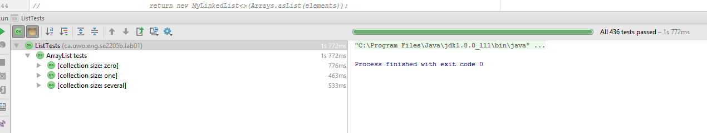
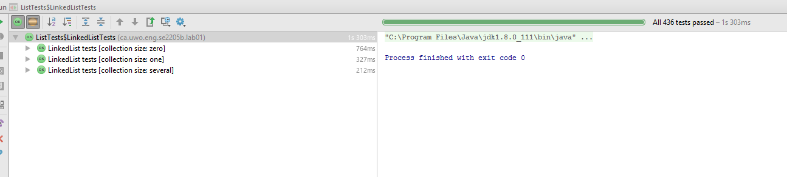
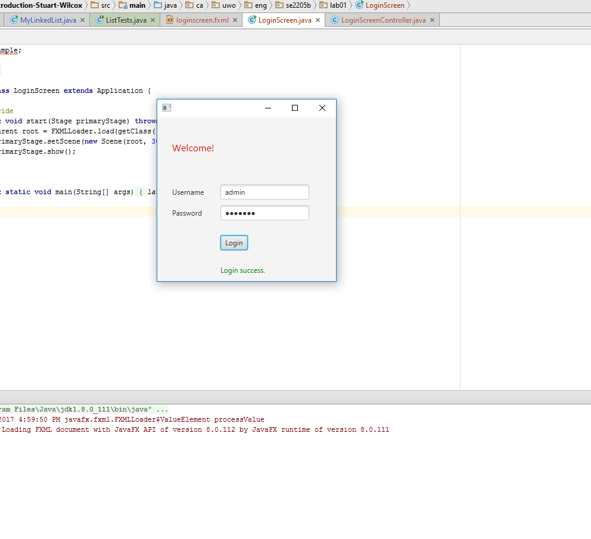

# Lab 01 - Lists and GUI Introduction

See lab document: <https://uwoece-se2205b-2017.github.io/labs/01-lists-gui-introduction>

## Questions

## Question 1




Q:
```
1. In an ideal scenario, what other methods should be overriden to improve performance?
2. Why is the iteration on ArrayList and LinkedList not the same speed (Not complexity, actual speed)? Which one is most likely faster?
3. Is the big-Oh complexity of the four main operations identical between the List types (add(), remove(), get() and set())?
4. Describe the benefit(s) of the tests provided.
```
A:
```
1. ArrayList
    addAll
    removeAll
    iterator
    lastIndexOf
   LinkedList
    addAll
    removeAll
    iterator
    subList
    lastIndexOf
    
2. The iteration on the LinkedList is likely slower then ArrayList, since the ArrayList's underlying array has memory stored contiguously, and accesses it in guaranteed O(1) time, while LinkedList stores memory randomly and is nearly guaranteed to take longer than array access.

3. ArrayList:
    add()     O(n)
    remove()  O(n)
    get()     O(1)
    set()     O(1)
   LinkedList:
    add()     O(n)
    remove()  O(n)
    get()     O(n)
    set()     O(n)

4. The benefits of the provided test were that all test cases were executed. It is important to be able to appropriately deal with invalid user input, and edge cases where there is exceptional behaviour.
```

## Question 2


Q:
```
1. Why is FXML used over raw code?
2. What is the benefit of using SceneBuilder?
3. What are a callbacks and why does JavaFX use them?
```
A:
```
1. It is much easier to use to build a layout structure.
2. This allows a graphical environment to build the view.
3. Callbacks are functions that execute when a certain event occurs. Used by most GUI platforms.
```
